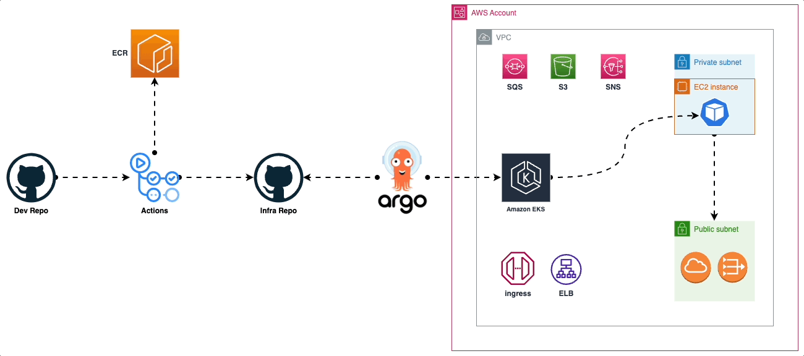

  

# DevOps - Continuous Integration and Continuous Deployment (CI/CD) with AWS and Kubernetes

**DevOps BookInfo** on Continuous Integration and Continuous Deployment (CI/CD) with AWS and Kubernetes! 

## Table of Contents

- [Introduction](#introduction)
- [Getting Started](#getting-started)
- [Prerequisites](#prerequisites)
- [About the Application](#application)
- [Agenda](#agenda)
- [Stack](#stack)

## Introduction

**Continuous Integration and Continuous Deployment (CI/CD)** have become essential practices to ensure smooth, efficient, and reliable software delivery. CI/CD enables development teams to automate the build, testing, and deployment processes, resulting in faster feedback loops and more frequent releases with fewer errors.

This repo is designed for setting up CI/CD pipelines using a powerful stack consisting of **GitHub Actions, AWS (Amazon Web Services), EKS (Amazon Elastic Kubernetes Service), ArgoCD, Terraform, ECR (Amazon Elastic Container Registry), Grafana, and Prometheus**. 

## Getting Started

To get started, follow these steps:

1. **Clone this repository** to your local machine.
2. Review the **[Agenda](#agenda)** to understand the topics covered.
3. Ensure you have all the **[prerequisites](#prerequisites)** installed and set up on your system.
4. Follow the step-by-step instructions provided in the **workshop documentation** to implement CI/CD pipelines for sample projects.

## Prerequisites

You should have the following prerequisites installed and configured on your local machine:

- Git
- Docker
- Any modern code editor (e.g., Visual Studio Code, Sublime Text, etc.)
- A GitHub account
- An AWS account with administrative privileges

## About the Application

The application displays information about a book, similar to a single catalog entry of an online book store. Displayed on the page is a description of the book, book details (ISBN, number of pages, and so on), and a few book reviews.

The Bookinfo application is broken into four separate microservices:

- **Productpage:** The productpage microservice calls the details and reviews microservices to populate the page.
- **details:** The details microservice contains book information.
- **reviews:** The reviews microservice contains book reviews. It also calls the ratings microservice.
- **ratings:** The ratings microservice contains book ranking information that accompanies a book review.

There are 3 versions of the reviews microservice:

1. Version v1 doesn’t call the ratings service.
2. Version v2 calls the ratings service, and displays each rating as 1 to 5 black stars.
3. Version v3 calls the ratings service, and displays each rating as 1 to 5 red stars.

### Application Architecture

This application is polyglot, i.e., the microservices are written in different languages. It’s worth noting that these services have no dependencies on Istio, but make an interesting service mesh example, particularly because of the multitude of services, languages and versions for the reviews service.

## Agenda

Project covers the following topics:

1. Introduction to CI/CD and its benefits.
2. Setting up a version-controlled project with Git and GitHub Actions.
3. Building Docker containers and pushing them to ECR.
4. Writing unit tests and test automation.
5. Setting up Kubernetes with EKS.
6. Configuring ArgoCD for automated deployments.
7. Implementing Infrastructure as Code (IaC) with Terraform.
8. Monitoring applications with Grafana and Prometheus.

## Stack

The project utilizes as [Bookinfo](#https://istio.io/latest/docs/examples/bookinfo/) demo app as a foundation and the following technologies and tools:

- **GitHub Actions**: CI/CD platform integrated with GitHub for automating workflows.
- **AWS**: Cloud services provider for hosting applications and managing infrastructure.
- **EKS**: Amazon Elastic Kubernetes Service for deploying, managing, and scaling containerized applications.
- **ArgoCD**: Declarative GitOps continuous delivery tool for Kubernetes.
- **Terraform**: Infrastructure as Code (IaC) tool for provisioning and managing AWS resources.
- **ECR**: Amazon Elastic Container Registry for securely storing and managing Docker images.
- **Grafana**: Monitoring and visualization platform for metrics.
- **Prometheus**: Open-source monitoring and alerting toolkit.

Happy coding and deploying!
